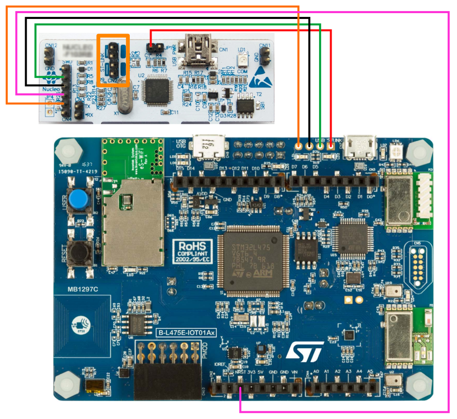
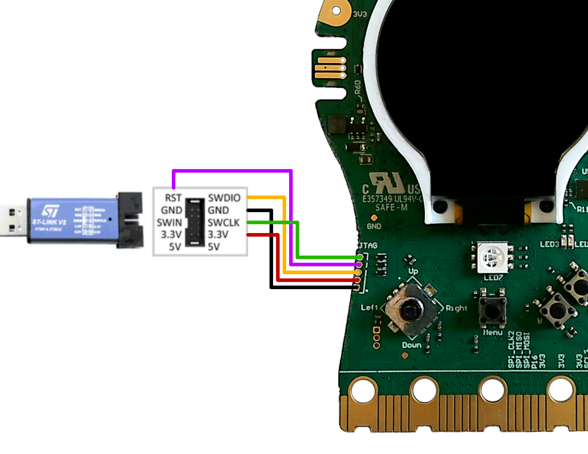

# DapLink - EasyFlash

English - [Français](README_fr.md)

- [DapLink - EasyFlash](#daplink---easyflash)
  - [Introduction](#introduction)
  - [Requirements](#requirements)
    - [:computer: System](#computer-system)
    - [:floppy\_disk: Bootloader \& Firmware](#floppy_disk-bootloader--firmware)
  - [Usage](#usage)
    - [:electric\_plug: Hardware](#electric_plug-hardware)
      - [STM32 Disco L475 IoTNode](#stm32-disco-l475-iotnode)
        - [STLink V2 (or clones)](#stlink-v2-or-clones)
        - [Black Magic Probe (V2.1 in this picture)](#black-magic-probe-v21-in-this-picture)
        - [Nucleo's STLink](#nucleos-stlink)
      - [STM32 Nucleo WB55](#stm32-nucleo-wb55)
      - [STeaMi](#steami)
    - [:computer: Software](#computer-software)
    - [:crab: Run from sources](#crab-run-from-sources)
  - [Test files](#test-files)
    - [`test-l475.bin`](#test-l475bin)
    - [`test-wb55.bin`](#test-wb55bin)

## Introduction
This tools is for internal usage, we use it to load daplink on target (STM32L475, STM32WB55, ...), to replace ST-LINK.

With OpenOCD, the program steps are :
  1. Unlock the RDP of the STM32F103xB
  2. Mass erase flash
  3. Flash bootloader
  4. Send firmware
  5. _(optionnal)_ Send test program 

_Appearance may vary depending on your OS configuration._

## Requirements

### :computer: System
To avoid installing OpenOCD on your computer, we recommend using the pre-built version maintained by [XPack](https://github.com/xpack-dev-tools/openocd-xpack/releases/tag/v0.12.0-4). The tested and compatible version is `v0.12.0-4`.

Once you've downloaded and decompressed the archive corresponding to your OS, move the files/folders as follows (the term _root folder_ refers to the folder where the `easy-flash-daplink-[version]-[os]` executable is located):
 - **All files** in the `bin` folder must be moved to the root folder.
 - The `scripts` folder in the `openocd` folder must be moved to the root folder
  
:bulb: The archives available in [releases](https://github.com/letssteam/DapLink-EasyFlash/releases) already contains all the files placed where they need to be.

:warning: **Mac OS X** is not yet supported, but PRs are welcome :wink:

### :floppy_disk: Bootloader & Firmware
- Bootloader
  - STM32F103xB: [https://github.com/letssteam/DAPLink/releases/latest/download/stm32f103xb_bl.bin](https://github.com/letssteam/DAPLink/releases/latest/download/stm32f103xb_bl.bin)

- Firmware
  - STM32L475VG: [https://github.com/letssteam/DAPLink/releases/latest/download/stm32f103xb_stm32l475vg_if.bin
](https://github.com/letssteam/DAPLink/releases/latest/download/stm32f103xb_stm32l475vg_if.bin
)  
  - STM32WB55RG: [https://github.com/letssteam/DAPLink/releases/latest/download/stm32f103xb_stm32wb55rg_if.bin
](https://github.com/letssteam/DAPLink/releases/latest/download/stm32f103xb_stm32wb55rg_if.bin
)  
  - STeaMi: [https://github.com/letssteam/DAPLink/releases/latest/download/stm32f103xb_steami32_if.bin
](https://github.com/letssteam/DAPLink/releases/latest/download/stm32f103xb_steami32_if.bin
)

:bulb: Older releases are available here: [https://github.com/letssteam/DAPLink/releases](https://github.com/letssteam/DAPLink/releases)

:warning: For other targets, please go directly to the [DapLink](https://github.com/ARMmbed/DAPLink) GitHub 
## Usage

### :electric_plug: Hardware
To enable the program to flash the bootloader, firmware and then the test program, the board must be wired to a probe (ST-Link, Black magic probe, etc.), and connected to the computer (using a micro-USB cable).

:warning: **Connect the target** (STM32 Disco L475 IoTNode, STM32 Nucleo WB55, ...) to your computer **after** wiring and **connecting the probe** to your computer

#### STM32 Disco L475 IoTNode
Here are somes schematics, to show you how to plug probes to the board.

##### STLink V2 (or clones)
")

##### Black Magic Probe (V2.1 in this picture)
")

##### Nucleo's STLink  
:warning: Remove both jumper `CN2` (orange rectangle) before flashing anything. Then **replace** them when you are finished.

#### STM32 Nucleo WB55

#### STeaMi

### :computer: Software
The program offer a simple GUI interface to select the bootload and the firmware that will be flashed on the STM32F1x.

  1. Select files you downloaded from [requirements](#floppy_disk-bootloader--firmware)
     1. The bootloader binary file to flash (e.g: `stm32f103xb_bl.bin`)
     2. The firmware binary file to flash (e.g: `stm32f103xb_stm32l475vg_if.bin`)
     3. _(optionnal)_ The program binary file to flash (you can find test program in `test bin` folder)
  2. Set the target mount point name (e.g: `DIS_L4IOT`, `DAPLINK`, `STEAMI`...)
  3. Define the timeout mount point waiting (e.g: `10`), in seconds
  4. Push the "Start" button.

:bulb: Pro tips: All inputs are saved for the next time you will open the tool !

### :crab: Run from sources
1. Install [rust](https://www.rust-lang.org/tools/install)
2. Clone or download this repository
3. Run `cargo run` from the project root.

## Test files
In the `test bin` folder, you can find some simple programs for targets. 

### `test-l475.bin`
It blinks the LEDs, `LD1` and `LD2`, in two different patterns.  

### `test-wb55.bin`
Toggles between high and low states of pins `PC10` and `PC12`.  (The video is the result on the STeaMi board).  
